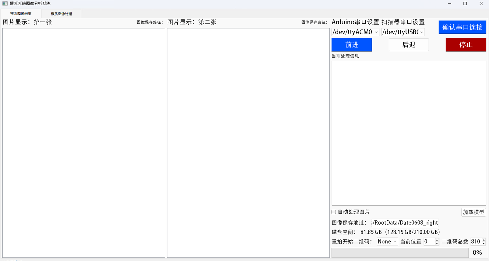
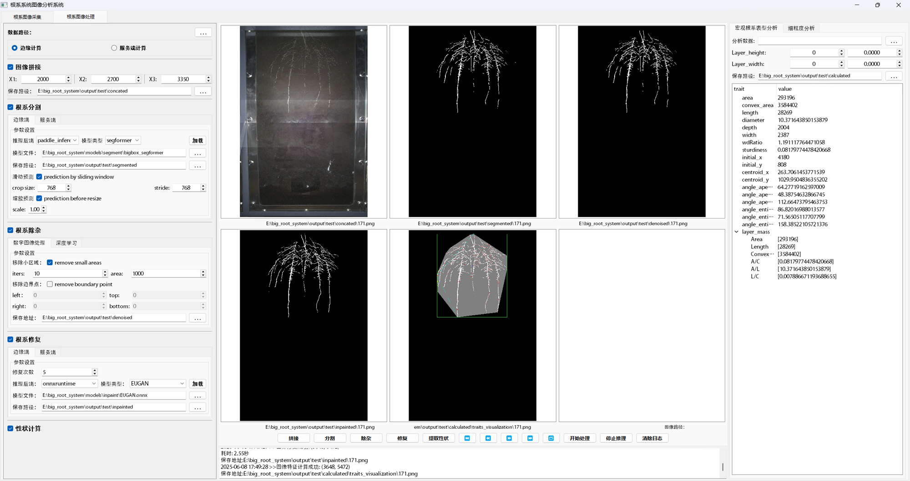

# Big Root Box System Documentation

## Language / 语言选择
- [English](#english-documentation)
- [中文](README_CN.md)

---

# English Documentation

## Project Introduction
This project is a PyQt5-based graphical interface application designed for plant root image processing and analysis. It integrates a complete workflow including image acquisition, stitching, segmentation, denoising, and repair, along with serial communication capabilities. Efficient processing is achieved through multi-thread management, and the FastDeploy framework is integrated to support GPU acceleration and TensorRT optimization, meeting the professional requirements of root phenotype analysis.
#### 1. Acquisition Interface

#### 2. Processing Interface


## Core Features
### 1. Image Processing Module
- **Image Capture**: Automated image acquisition and saving through the `ImgCapture_Thread` thread, supporting QR code scanning positioning and batch shooting<mcfile name="img_capture_thread.py" path="e:\big_root_system\threads\img_capture_thread.py"></mcfile>
- **Image Stitching and Segmentation**: Provides two modes - sliding window inference (`slide_predict`) and proportional scaling inference (`resize_predict`), supporting large-size image segmentation<mcfile name="img_seg_thread.py" path="e:\big_root_system\threads\img_seg_thread.py"></mcfile>
- **Root Denoising**: Deep learning model-based image denoising to remove soil background and noise interference<mcfile name="img_process_thread.py" path="e:\big_root_system\threads\img_process_thread.py"></mcfile>
- **Root Repair**: Image inpainting algorithms to fill missing parts in root images and optimize analysis results
- **Phenotype Parameter Calculation**: Automatically extracts 18 phenotypic parameters including root area, length, diameter, and angle<mcfile name="img_process_widget.py" path="e:\big_root_system\sub_widgets\img_process_widget.py"></mcfile>

### 2. Model Management Module
- **Multi-model Support**: Supports loading and inference of various models including segmentation, denoising, and repair
- **Hardware Acceleration**: Supports GPU, CPU, and TensorRT optimization, automatically selecting the best inference method based on hardware configuration<mcfile name="model_load_thread.py" path="e:\big_root_system\threads\model_load_thread.py"></mcfile>
- **Dynamic Shape Optimization**: Automatically adapts to different input sizes to optimize model inference performance

### 3. Serial Communication Module
- **Device Management**: Automatic detection, connection, and management of serial devices through the `SerialDevice` class<mcfile name="driver_serial.py" path="e:\big_root_system\drivers\driver_serial.py"></mcfile>
- **Data Transceiving**: Supports custom baud rates and data formats, with real-time monitoring of serial communication status
- **Integrated Control**: Links with the image acquisition module to实现 hardware device automation

## Directory Structure
```
e:\big_root_system
├── .gitignore               # Git ignore rules
├── main.py                  # Main program entry, integrating all functional modules
├── config\                  # Configuration files
│   └── default_cfg.py       # System default configuration
├── data\                    # Input data (Git ignored)
├── drivers\                 # Hardware drivers
│   ├── camera.py            # Camera driver
│   └── driver_serial.py     # Serial port driver
├── models\                  # Model files (Git ignored)
│   ├── inpaint\             # Inpainting models
│   └── segment\             # Segmentation models
├── output\                  # Output results (Git ignored)
├── signals\                 # Global signal definitions
│   ├── global_signals.py    # Custom signals
│   └── global_vars.py       # Global variables
├── sub_widgets\             # Interface components
│   ├── img_capture_widget.py# Image capture interface
│   ├── img_process_widget.py# Main image processing interface
│   ├── serial_assist_widget.py# Serial port assistant interface
│   ├── serial_setting_dialog.py # Serial port setting dialog
│   └── widgets_v1\          # Historical version interface components
├── threads\                 # Background threads
│   ├── img_capture_thread.py# Image capture thread
│   ├── img_process_thread.py# Image processing thread
│   ├── img_seg_thread.py    # Image segmentation thread
│   ├── model_load_thread.py # Model loading thread
│   └── utils\               # Thread utility functions
├── tools\                   # General tools
│   └── utils.py             # Byte decoding and other utility functions
├── ui\                      # Interface design files
│   ├── *.ui                 # Qt Designer interface files
│   └── resource.qrc         # Resource file
└── requirements.txt         # Environment dependencies
```

## Environment Configuration
### 1. Basic Dependency Installation
```bash
# Create virtual environment (recommended)
conda create -n root_analysis python=3.9
conda activate root_analysis

# Install dependencies (in project root directory)
pip install -r requirements.txt

# Optional: Choose GPU or CPU version based on hardware configuration
# GPU environment (recommended)
pip install pyqt5 pyserial opencv-python numpy fastdeploy-gpu onnxruntime-gpu

# CPU environment
# pip install pyqt5 pyserial opencv-python numpy fastdeploy onnxruntime
```

### 2. Hardware Configuration (Optional)
- **Camera Driver**: Ensure the camera driver is properly installed and recognizable by OpenCV
- **Serial Port Permissions** (Linux/macOS):
  ```bash
  sudo usermod -aG dialout $USER
  reboot
  ```

## Usage Guide
### 1. Quick Start
```bash
# Run in project root directory
python main.py
```
The main interface will display tabs for all available functional modules, including image acquisition, image processing, and serial port assistant.

### 2. Image Segmentation Workflow
1. Select the "Root Image Processing" tab in the main interface
2. Click the "Model Path" button and select the model directory containing the following files:
   - model.pdmodel (model structure)
   - model.pdiparams (model parameters)
   - deploy.yaml (configuration file)
3. Click "Load Model" and select the acceleration method (GPU/CPU/TensorRT)
4. Set segmentation parameters:
   - Sliding window size (default 512x512)
   - Sliding step (default 256)
   - Inference mode (sliding window/proportional scaling)
5. Click "Start Segmentation", and the processing progress will be displayed in the log window

### 3. Batch Image Processing
1. Select the "Batch Processing" tab in the "Root Image Processing" interface
2. Set the input directory (containing images to be processed) and output directory
3. Check the processing steps to be executed (segmentation, denoising, repair, phenotype analysis)
4. Click "Start Batch Processing", and the system will automatically process all images and save the results

## Model Downloads
| Model Type | Version | Download Link | Size |
|---------|------|---------|------|
| Root Segmentation Model | v1.0.0 | [GitHub Releases](https://github.com/Tansong666/big_root_box_system/releases/download/v1.0.0/bigbox_segformer.zip) | 145MB |
| Root Denoising Model | v1.0.0 | [GitHub Releases](https://github.com/Tansong666/big_root_box_system/releases/download/v1.0.0/denoise_model.zip) | 98MB |
| Root Repair Model | v1.0.0 | [GitHub Releases](https://github.com/Tansong666/big_root_box_system/releases/download/v1.0.0/inpaint_model.zip) | 210MB |
| Test Dataset | v1.0 | [GitHub Releases](https://github.com/Tansong666/big_root_box_system/releases/download/v1.0/root_data_demo.zip) | 380MB |

## Notes
1. **Performance Optimization**:
   - Sliding window mode is recommended for large-size images
   - TensorRT acceleration will generate cache files on first run (about 1-2 minutes), subsequent runs will be significantly faster
   - When batch processing, it is recommended to set a reasonable number of threads to avoid memory overflow

2. **File Management**:
   - Image data should be stored in the `data/` directory
   - Model files should be stored in the `models/` directory
   - All output results will be automatically saved to the `output/` directory, classified by date and processing type

3. **Common Issues**:
   - Model loading failure: Check if the model files are complete and the configuration is correct
   - Abnormal image display: Try adjusting the image scaling ratio or restarting the program
   - Serial port connection failure: Check if the device is properly connected and permissions are configured

## Development Instructions
The project adopts a modular design, mainly divided into the following parts:
- **Interface Layer**: PyQt5-based graphical interface, located in the `sub_widgets/` directory
- **Business Logic Layer**: Background processing threads, located in the `threads/` directory
- **Driver Layer**: Hardware device interfaces, located in the `drivers/` directory
- **Tool Layer**: General function functions, located in the `tools/` directory

To extend functionality, it is recommended to implement new thread classes and interface components while maintaining consistency with the existing architecture.

---

        